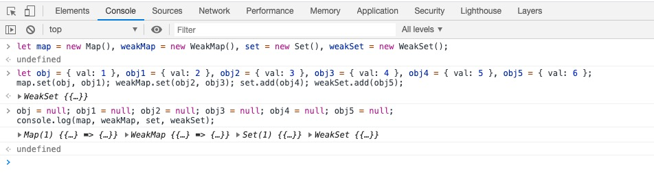
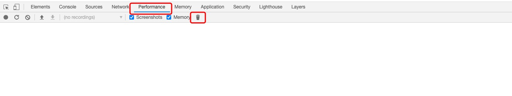
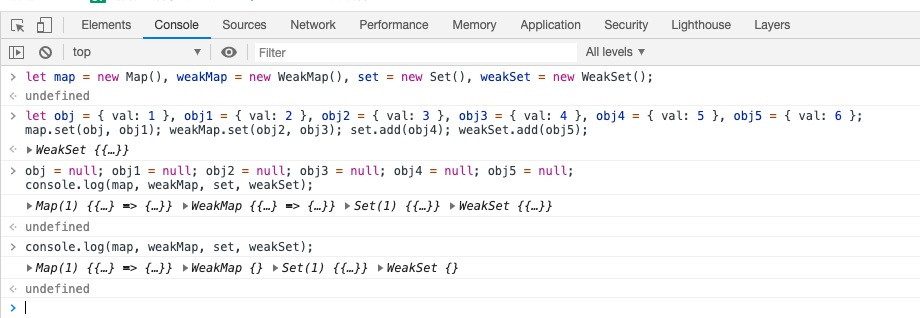

### Map和WeakMap
> 必须要在浏览器中的console中进行操作

首先建立Map/WeakMap/Set/WeakSet
```
let map = new Map(), weakMap = new WeakMap(), set = new Set(), weakSet = new WeakSet();
```
分别给各个Set/Map赋值
```
let obj = { val: 1 }, obj1 = { val: 2 }, obj2 = { val: 3 }, obj3 = { val: 4 }, obj4 = { val: 5 }, obj5 = { val: 6 };
map.set(obj, obj1); weakMap.set(obj2, obj3); set.add(obj4); weakSet.add(obj5);
```
然后给各个obj赋值为空(引用-1)/打印各个Map&Set
```
obj = null; obj1 = null; obj2 = null; obj3 = null; obj4 = null; obj5 = null;
console.log(map, weakMap, set, weakSet);
```
;

随后点击浏览器中手动触发垃圾回收

;

再次打印 map/set 发现 weakMap & weakSet 为空了

;