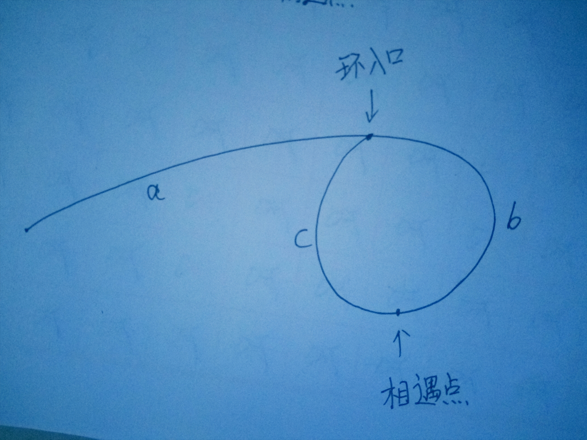

## 找出链表中环的入口节点
这章前我们可以先看 [确定链表中是否有环](../checkCircle)



假设从头节点到环入口的距离为 a 环入口到相遇点的距离为 b 相遇点到环入口的距离为 c

因为快慢指针是一个走 1 步一个走 2 步假设快指针比慢指针多走了 k 圈那么

```
2(a+b) = a+k(b+c)+b

a+b = k(b+c)
a = (k-1)(b+c) + c 
```
这样我们只需要在相遇点放上一个指针,链表头部放上一个指针两个指针都走1步当两个指针相遇的时候那个节点就是头节点