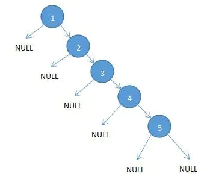
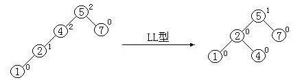
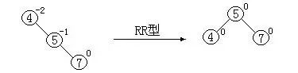

## 平衡搜索二叉树
出现平衡搜索二叉树的原因是如果二插搜索树的节点是1,2,3,4,5那么树就退化成了链表


这个时候我们就要将搜索二叉树平衡一下成为平衡搜索二叉树

### 平衡因子
如何来判断这个节点是否平衡这个时候就需要引入一个平衡因子的概念

平衡因子 = 左子树深度 - 右子树深度

当所有节点平衡因子为 0, 1, -1 时说明这颗二叉搜索树是平衡二插搜索树

### 二叉搜索树转化为平衡二叉搜索树
当二叉搜索树的时候有四种情况

1. 单右旋平衡处理


```
// 找到左子树第一个平衡因子为1的节点的父节点 node 然后进行旋转
function rotationRR(node) {
  const tmp = node.left;
  node.left = tmp.right;
  tmp.right = node;
  return tmp;
}

```
2. 单左旋平衡处理

```
// 和左左型相反
function rotationLL(node) {
  const tmp = node.right;
  node.right = tmp.left;
  tmp.left = node;
  return tmp;
}
```
3. 右左平衡处理
```
// 头节点平衡因子为-2, 找到右子树的平衡因子节点为 1 那么需要对该节点进行右旋，然后对该节点的父节点进行左旋
function rotationRL(node) {
  const tmp = rotationRR(node.right);
  node.right = tmp;
  const result = rotationLL(node);
  return result;
}
```
4. 左右平衡处理
```
// 和右左相反
```