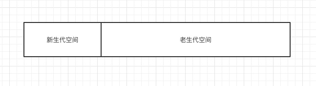
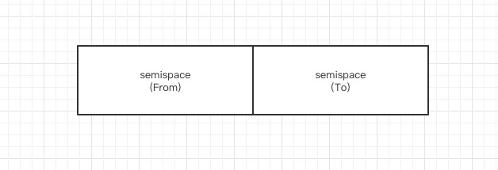
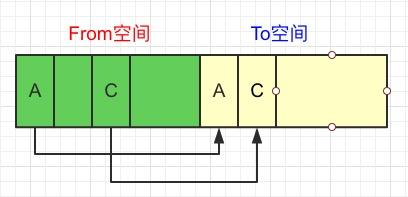
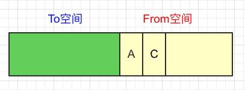
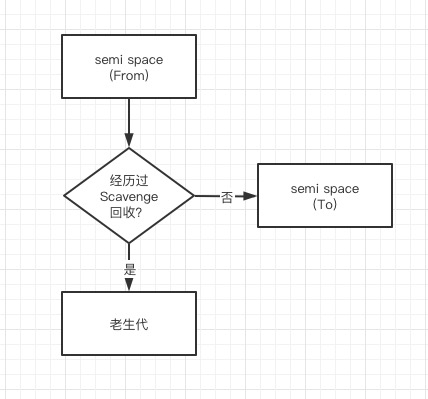
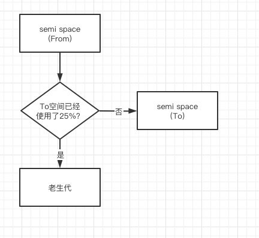

## V8的垃圾回收机制

### 分代内存
在V8中,主要将内存分为新生代和老生代两代。新生代中的对象为存活时间较短的对象,老生代中的对象为存活时间较长或常驻内存的对象。

默认情况下 64 位系统下只能使用 1464MB, 32 位则为 732MB
#### 新生代
新生代中的对象主要通过 Scavenge 算法。 Scavege 算法的具体实现中,主要采用了 Cheney 算法。

Cheney 算法是一种采用复制的方式实现的垃圾回收算法。会将堆内存一分为二,每一部分空间称为 semispace 正在使用的 semispace 空间称为 From 空间。处于空闲的闲置状态的空间叫做 To 空间。当我们分配对象时,先是在 From 空间中进行分配。当进行垃圾回收时,会检查 From 空间中的存货对象, 这些存活对象将赋值到 To 空间,而非存活对象占用的空间就会被释放。而非存活对象占用的空间将会被释放。完成复制之后 From 和 To 空间就会发生对换。

1. semispace 空间分配

2. 将活跃对象从 From 空间复制到 To 空间

3. 清空From空间全部内存,然后将 From/To 空间对调

- 缺点: 只能使用堆内存的一半,这是由于复制机制和划分空间所决定的。
- 优点: 值复制存活的对象,并且对生命周期短的场景存活对象只占少部分,所以时间效率上有优异的表现
#### 晋升
在单纯的 Scavenge 过程中,Form空间中的存活对象会被赋值到 To 空间中去, 然后对 From 空间和 To 空间进行对换。但在一定条件下,需要将存活周期长的对象移动到老生代中,也就是完成对象的晋升。

在默认情况下,V8的对象分配主要集中在 From 空间中。对象从 From 空间复制到 To 空间时,会检查它的内存地址来判断这个对象是否已经经历过一次 Scavenge 回收。如果经历过了,会将该对象从 From 空间复制到老生代空间中。如果没有就复制到 To 空间中。

另一个判断方式是 To 空间的内存占用比。当要从 From 空间复制一个对象到 To 空间时, 如果 To 空间已经使用了超过 25%。则这个对象直接晋升到老生代空间中。设置 25% 这个限制值的原因是当这次 Scavange 回收完后, To 空间将会变成 From 空间。如果占比过高, 会影响后续内存分配。

#### 老生代
- Mark-Sweep (标记清除)

因为老生代对象中,存活对象较多,所以不采用 Scavenge

- Mark-Compact (标记整理)

- Incremental Marking (增量标记)