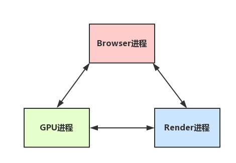
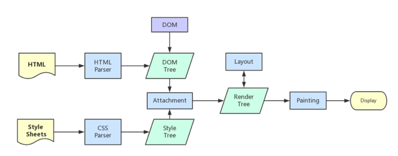

## 浏览器的进程与线程模型
- 进程: 是系统进行资源分配和调度的基本单位,是操作系统结构的基础
- 线程: 操作系统能够进行运算调度的最小单位,被包含在进程中

### 浏览器进程
1. Browser进程: 浏览器中的主进程(负责协调、主控),只有一个,作用为:
  - 负责浏览器界面显示,与用户交互
  - 负责各个页面的管理,创建和销毁其他进程
  - 将渲染(Renderer)进程得到的内存中的Bitmap(位图),绘制到用户界面上
  - 网络资源的管理,下载等
2. 第三方插件进程: 每种类型的插件对应一个进程,仅当使用该插件时才创建
3. GPU进程: 最多一个,用于3D绘制
4. 浏览器渲染进程(即通常所说的浏览器内核) (Renderer进程,内部是多线程的): 主要作用为页面渲染,脚本执行,事件处理等。
  - 一般来说是一个 Tab 对应一个进程,但是浏览器有自己的优化机制,打开多个tab页后,有些进程会被合并。

> 多进程浏览器的优点: 1.避免 page crash 影响整个浏览器。2.避免第三方插件crash影响整个浏览器。3.多进程充分利用多核优势。4.方便使用沙盒模型隔离插件等进程,提高浏览器稳定性
### 渲染进程下的线程
1. GUI渲染线程
  - 负责渲染浏览器界面,解析HTML,CSS,构建DOM树和RenderObject树,布局和绘制等。
  - 当界面需要重绘(Repaint)或者由于某种操作引发回流(reflow)时,该线程就会执行
  - 注意,GUI渲染线程和JS引擎线程时互斥的,当JS引擎执行时GUI线程会被挂起(相当于被冻结了),GUI更新会被保存在一个队列中等待JS引擎空闲时立即被执行
2. JS引擎线程(单线程)
  - 也称JS内核,负责处理JavaScript脚本程序。(例如V8引擎)
  - JS引擎负责解析JavaScript脚本,运行代码
  - JS引擎一直等待着任务队列中任务的到来,然后加以处理,一个Tab页(renderer进程)中无论如何都只有一个JS线程在运行JS程序
  - 同样注意,GUI渲染线程与JS引擎线程是互斥的,所以如果JS执行的时间过长,这样就会造成页面的渲染不连贯,导致页面渲染加载阻塞
3. 事件触发线程
  - 归属于浏览器而不是JS引擎,用来控制事件循环
  - 当JS引擎执行代码块如setTimeOut时(也可能来自浏览器内核的其他线程,如鼠标点击、AJAX异步请求等),会将对应任务添加到事件线程中
  - 当对应的事件符合触发条件被触发时,该线程会把事件添加到待处理队列的队尾,等待JS引擎的处理
  - 注意,由于JS单线程的关系,所以这些待处理的事件都得排队等待JS引擎处理(当JS引擎空闲时才会去执行)
4. 定时触发器线程
  - 传说中 setInterval 和 setTimeout 所在线程
  - 浏览器定时计数器并不是由JavaScript引擎计数,(因为JavaScript是单线程的,如果处于阻塞线程状态就会影响计时的准确)
  - 因此通过单独线程来计时并触发定时(计时完毕后,添加到事件队列中,等待JS引擎空闲后执行)
  - 注意,W3C在HTML标准中规定,规定setTimeout低于4ms的时间间隔算为4ms
5. 异步http请求线程
  - 在XMLHttpRequest在连接后通过浏览器新开一个线程请求
  - 将检测到状态变更时,如果设置有回调函数,异步线程就产生状态变更事件,将这个回调再放入事件队列中。再由JavaScript引擎执行


### Browser进程和浏览器内核(Renderer进程)的通信过程
- Browser进程收到用户请求,首先需要获取页面内容(譬如通过网络下载资源),随后将该任务通过RenderHost接口传递给Render进程
- Render进程的Renderer接口收到消息,简单解释后,交给渲染线程,然后开始渲染
   - 渲染线程接收到请求,加载网页并渲染网页,这其中可能需要Brower进程获取资源和需要GPU进程来帮助渲染
   - 当然可能会有JS线程操作DOM(这样可能会造成回流并重绘)
   - 最后Render进程将结果传递给Browser进程
- Browser进程接收到结果并将结果绘制出来


### 渲染进程中线程之间的关系
1. GUI线程与JS引擎线程互斥: 由于JavaScript是可操纵DOM的,所以在修改这些元素属性的时候同时渲染界面,那么渲染线程前后获得的元素数据可能不一致
2. JS阻塞页面加载: 由于上面的互斥关系,如果JavaScript存在大量计算,那么就算GUI有更新,也会被保存在队列中,等待JS引擎空闲后执行。所以如果巨量计算,页面会变的巨卡无比
3. WebWorker,JS的多线程？: HTML支持了`Web Worker`
  - 创建`Worker`时,JS引擎向浏览器申请开一个子线程(子线程是浏览器开的,完全受主线程控制,而且不能操作DOM)
  - JS引擎线程与worker线程间通过特定的方式通信(postMessage API,需要通过序列化对象来与线程交互特定的数据)
4. webworker和shareWorker
  - WebWorker只属于某个页面,不会和其他页面的Render进程(浏览器内核)共享
     - 所以Chrome在Render进程中(每一个Tab页就是一个Render进程)创建一个新的线程来运行Worker中的JavaScript
  - ShareWorker是浏览器所有页面共享的,不能采用和Worker同样的方式实现,因为它不隶属于某一个Render进程,可以为多个Render进程共享使用
     - 所以Chrome浏览器为ShareWorker单独创建一个进程来运行JavaScript程序,在浏览器中每个相同的JavaScript只存在一个ShareWorker进程,不够它创建多少次
  - 可以看书来SharedWorker由独立的进程管理,WebWorker只是属于render进程下的一个线程

### 浏览器渲染流程
浏览器拿到内容之后,渲染大概可以划分为以下几个步骤
1. 解析html建立dom树
2. 解析css建立style树
3. 将dom树和style树合成render树
4. 布局render树,负责各元素尺寸、位置的计算
5. 绘制render树,绘制页面像素信息
6. 浏览器会将各层的信息发送给GPU进程,GPU会将各层合成(composite),显示在屏幕上
7. 触发load事件



> 注意: load 事件和 DomContentLoaded 的区别

- DOMContentLoaded: 初始的HTML文档完全家在和解析完成之后触发。但是注意:DOMContentLoaded需要在所属script之前的样式表加载完才触发
- load: 页面上所有DOM,样式表,脚本都已经加载完成了(渲染完毕)

所以顺序是 DOMContentLoaded -> load

从上图我们还可以看到css加载不会阻塞DOM树的解析,但是会阻塞Render树渲染

> 注意: 步骤6的时候,各层值的是一些复合图层

### 普通图层和复合图层
浏览器的图层一般包含两大类: `普通图层`和`复合图层`

首先普通文档流内可以理解为一个复合图层(里面不管添加多少个元素都是同一个复合图层中,就算是absolute,虽然脱离了文档流,但还是属于文档流图层内)

可以通过硬件加速的方式,声明一个新的复合图层,它会单独分配资源(当然也会脱离普通文档流,这样一来,不管这个复合图层怎么变化,也不会影响默认复合层里的回流重绘)

GPU中,各个复合图层是单独绘制的,所以互不影响,这也是为什么某些场景硬件加速效果一级棒

那什么是硬件加速呢?

硬件加速: 就是将浏览器的渲染过程交给GPU处理,而不是使用自带的比较慢的GUI渲染线程

如何创建复合图层(合成层)呢?

- 直接原因
   - <video><iframe><canvas><webgl>等元素
   - 3d或透视变换css属性,比如translate3d,translateZ等等
   - 混合插件 (比如flash)
   - position: fixed
   - 对 opacity/transform/filter/backdropfilter应用了animation或者transition
   - will-change设置opacity/transform/top/left/bottom/right(其中top/left等需要设置明确的定位属性,比如relative等)
- 其他元素原因
   - 有合成层后代同时本身有 transform/opacity(小于1)/mask/fliter/reflection/overflow不为visible
   - 有z-index小与当前元素的兄弟合成层元素
  
一般来说想要硬件加速使用`transform: translateZ(0)`或者`transform:translate3d(0,0,0)`或者设置`will-change`等

因为其他元素会导致生成很多复合图层,所以浏览器会进行层压缩


这里绿色是一个复合图层之后粉色和淡蓝色就变成了复合图层(因为z-index大于绿色)但是这个时候粉色和淡蓝色就会进行合成成为一个图层(层压缩),这是因为如果每个复合图层都要消耗GPU这不是严重影响性能了吗。所以会有层压缩来防止过度复合图层出现层爆炸(大量额外合成层)的原因

虽然会有层压缩来防止层爆炸,但是有些情况浏览器是无法进行层压缩的,所以我们应该避免
- 层压缩会打破渲染顺序的压缩
- video元素
- iframe、plugin的渲染层
- 有reflection属性的渲染层
- 有blend mode属性的渲染层
- 渲染层同复合图层有裁剪容器时(比如overflow:hidden)
- 相对于复合图层滚动的渲染层
- 两个要合成的复合图层有不同opacity/transform/filter值的父级
- 正在执行动画的复合图层

### 从Event Loop谈JS的运行机制
JS执行是单线程但是浏览器进行运行JS时是用多线程的
- JS引擎线程
- 事件触发线程
- 定时触发器线程
- http请求线程

Event Loop

- JS分为同步任务和异步任务
- 同步任务都在JS引擎线程上至下,形成一个主执行栈
- 当定时触发器线程等待一端时间后将任务放到事件触发线程的任务队列汇总
- 主线程之外,事件触发线程管理一个任务队列,只要异步有了运行结果,就会在任务队列中放置一个事件
- 一旦执行栈中所有同步任务执行完成(此时JS引擎空闲),系统就会读取任务队列,将可运行的异步任务添加到可执行栈中,开始执行


定时器

- 当使用计时器时,它需要定时器线程计时,计时完成之后就会将特定的事件推入到事件触发线程的队列中
- setTimeout被W3C标准中规定最低4ms如果低于4ms也算4ms
- setInterval每次精准隔一段时间就会推入一个事件,所以如果JS主执行栈逻辑复杂,可能setInterval会一瞬间全部执行
- setTimeout是计时到后推入事件队列,然后执行一段时间之后会继续setTimeout
- 所以目前认为的最佳方案是用setTimeout代替setInterval或者特殊情况使用requestAnimation

### macrotask(宏任务)和microtask(微任务)

- macrotask: 每次执行栈执行的代码就是一个宏任务(包括每次从事件队列中获取一个事件回调并放到执行栈中执行)
   - 每一个task会从头到尾将这个任务执行完毕,不会执行其他
   - 浏览器为了能够让JS内部和DOM任务能够有序的执行,会在一个task执行结束后,在一个task执行开始前,对页面进行重新渲染
   - 除了MutationObserver和Promise().then()和process.nextTick的所有
   ```
   task -> 渲染 -> task -> 渲染
   ```
- microtask: 可以理解当前task执行结束之后立即执行的任务
   - 也就是说在当前task后下一个task前,在渲染之前
   - 所以它的响应速度相比setTimeout更快,因为无需等渲染
   - 也就是说,在某一个macrotask执行完后,就会在它执行期间产生的所有microtask都执行完毕
   - 微任务是有优先级的 process.nextTick > promise.then() > MutationObserver

> 注意: 虽然click的回调是一个宏任务但是它会导致事件同步分发比如

```
document.body.onclick = () => {console.log(1)};
document.body.click();
console.log(2)
```
这里会先打印1后打印2


### 使用MutationObserver实现microtask

MutationObserver可以用来实现microtask(虽然它属于microtask,但是它的优先级略小于Promise,一般是promise不支持才会使用MutationObserver)

是一个H5的新特性,作用是监听一个DOM的的变动,当DOM发生变动后,MutationObserver就会得到通知
```
let context = 1;
const nextTickHander = () => {console.log(123)};
const observer = new MutationObserver(nextTickHander)
const dom = document.createTextNode(String(context));
observer.observe(dom, { characterData: true });
const timeFun = () => {
  context = (context+1)%2;
  dom.data = String(context)
}
```
// 每次调用timeFun都会向微任务队列汇总