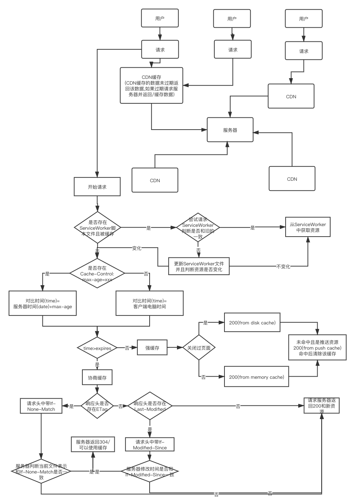

## 浏览器缓存
### 强缓存
如果命中强缓存后,浏览器不会去请求服务器,而是直接从使用本地缓存的资源,并返回状态码200(缓存资源来源)。是否命中强制缓存应该使用响应头中的`expires`和`Cache-Control`来进行控制

1. `expires`是 http1.0 的产物,表明服务器过期的时间,当请求客户端的时间超过`expires`时间时,就会去请求服务器
  - 但是`expires`是有问题的,当用户的系统时间改到这个标志时间之后,就永远都不会命中这个缓存了
2. `Cache-Control`是 http1.1 的产物,他可以看做是`expires`的补充,下面是一些expires的常用值
  - max-age: 设置最大缓存的有效时间,单位为秒(s)。max-age会覆盖expires
  - s-maxage: 设置代理服务器缓存的有效时间,单位为秒(s)。s-maxage会覆盖max-age
  - public: 表明可以被任何对象缓存(客户端/代理服务器等)
  - private: 只能被发起请求的浏览器缓存
  - no-cache: 字面意思是"不要缓存",但是实际的机制是,任然对资源使用缓存,但是每一次使用之前都必须向服务器对缓存资源进行验证
  - no-store: 所有内容都不被缓存,既不使用强缓存也不使用协商缓存
  - must-revalidate: 如果你配置了max-age信息,当缓存资源小于max-age时使用缓存,否则需要对资源进行验证
3. 判断缓存是否过期的步骤:
  1. 判断是否存在max-age/s-maxsge,有则使用 服务器时间 + max-age/s-maxage 来判断是否使用缓存 (服务器时间会在第一次请求服务器时记录下来)
  2. 如果没有则使用 expires 来判断是否使用缓存
### 协商缓存
顾名思义就是和服务器商量一下是否使用缓存,命中协商缓存的话会返回304

协商缓存由响应头中的`Last-Modified`和`ETag`还有请求头中的`If-Modified-Since`和`If-None-Match`控制

- 响应头: `Last-Modified`/`ETag`
- 请求头: `If-Modified-Since`/`If-None-Match`

- `If-Modified-Since`: 保存的是上次服务器传给浏览器的文件最后改变时间(上次请求服务器的`Last-Modified`)
- `Last-Modified`: 服务器的文件最后修改时间
- `If-None-Match`: 保存的是上次服务器传给浏览器文件在服务器的唯一标识(每个服务器实现都不一样)(上次请求服务器的`ETag`)
- `ETag`: 保存的是当前文件在服务器的唯一标识(每个服务器实现都不一样)

所以当需要协商是否使用缓存的时候
1. 服务器会先判断是否有`If-None-Match`如果有则判断和当前资源标识是否一致,如果一致则`304`,不一致返回`200`并且返回新的资源
2. 如果请求头中没有`If-None-Match`则判断是否有`If-Modified-Since`,如果有服务器则判断最后时间是否一致,如果一致则`304`,不一致返回`200`并且返回新的资源
3. 如果请求头中`If-Modified-Since`和`If-None-Match`都不存在则直接返回`200`和新的资源
4. `If-None-Match`优先级高于`If-Modified-Since`

而是否请求头中是否带上`If-None-Match`和`If-MOdified-Since`和上一次请求服务器响应头中是否带`ETag`和`Last-Modified`有关

为什么有了`If-Modified-Since`还要有个`If-None-Match`呢？
- 是因为`Last-Modified`只能精确到秒级别,而有些文件会在1s钟变化多次,这样就会有误差
- 有些文件会定期生成,而这些文件没有任何变化,而此时`Last-Modified`却改变了,导致文件无法使用缓存
- 可能存在服务器没有准确获取文件修改时间,或者与代理服务器时间不一致的情形
### CDN缓存
什么是CDN?
> CDN 即 connect delivery network。内容分发网络,它可以帮你的请求打到离你最近的服务器上。CDN的本质就是缓存。

CDN的优点
- 访问加速,减少了时延。
- 减轻源站(服务器)负载。如果CDN已经有数据了就不用访问服务器了,自然减轻负载
- 抗住攻击。减轻了源站的负载自然就更能抗住攻击

CDN的原理
- 首先在地址栏输入王者,浏览器发现本地没有关于这个网址的DNS缓存,所以向网站DNS服务器发起请求
- 网站的 DNS 服务器设置了 CNAME,指向了某个CDN服务器,也就是我们常见的阿里云、腾讯云、Cloudflare之类的,去请求CDN中只能DNS均衡负载系统
- 负载均衡系统解析域名,把对用户最快的节点返回给用户,然后用户向该节点发出请求
- 如果CDN第一次访问该内容,CDN服务器会向源站请求数据并缓存,否则在缓存节点找到该数据,将请求结果发送给用户

CDN缓存设置
> 缓存的设置,max-age,在Cache-Control中经常用于缓存的控制, 可是 max-age 设置的缓存会应用于一个请求经过的每一级, 如果我们希望 CDN 不缓存那么久,那我们就应该使用 s-maxage,它用于代理服务器的缓存时间,会覆盖max-age的设置,这样我们就可以吧max-age用于本地缓存,把s-maxage用于CDN的缓存,避免脏数据

CDN缓存命中
> 各大厂商的CDN返回的数据中都会有一个X-Cache, 上面内容是Hit或者Miss, 还会加上Memory或者Disk的缩写表示内存还是磁盘,如果出现Upstream或者Miss表示没有命中

其实可以把 CDN 节点当做一个浏览器,源服务器当做一个需要请求的服务器。用户浏览器的缓存可能不是最新的,而CDN有其他用户请求过,所以可能是新的,所以就用CDN的资源了,减缓了服务器的压力

### 强缓存的几个位置
1. Memory Cache: 内存中的缓存,一般是页面刷新后,浏览器从内容中获取的缓存,从内存获取比从硬盘中获取速度快。当页面关闭之后内存就会释放
2. Disk Cache: 存在硬盘中的缓存,重新打开页面之后.会从硬盘中获取缓存.和Memory Cache最大的区别是,关闭页面之后不会被清除。
3. Push Cache: 推送缓存是 http2.0 标准下针对推送资源设定的.推送缓存是 Session 级别的,如果用户的 session 结束则资源被释放。即使URL相同但处于不同的session中也不会发生匹配。推送缓存的储存时间较短,Chrome中只有5分钟左右。
4. Service Worker: 看我写的[PWA](https://github.com/ChunchunIsMe/learningPWA)总结吧

### 总结
画了张图,总结+自己的理解吧

