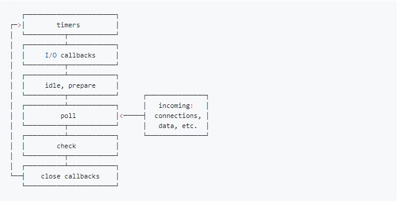

## NodeJS中的EventLoop
nodejs和浏览器的区别,就是nodejs的宏任务分好几种,而且这好几种又有不同的任务队列,而且不同的任务队列又有顺序区别,而微任务是穿插在每一种(注意不是每一个)宏任务之间的



各个阶段执行的任务如下
- timers阶段: 这个阶段执行setTimeout和setInterval预定的callback
- I/O callback阶段: 除了close事件、timers、setImmediate设定的callback的所有callback
- idle,prepare: 仅供node内部使用
- poll阶段: 获取新的I/O事件,适当条件下node将阻塞在这里
- check阶段: 执行setImmediate()设定的callback
- close callback阶段,执行socket.on('close',...)这些callback

> NodeJS中的宏任务主要有4个

从上面的介绍可以看到,回调事件主要位于4个宏任务中
1. Timer Queue
2. IO Queue
3. check Queue
4. close Queue

NodeJS中微任务主要有2个
1. Next Tick Queue: 是放置process.nextTick(callback)的回调任务的(注意整个的优先级会高于所有微任务,每一次清空微任务列表的时候会先执行)
2. Other Micro Queue: 是放置其他microtask,比如Promise等

大体上整理一下NodeJS的EventLoop过程
1. 执行同步代码
2. 清空微任务列表
3. 执行所有定时器callback,执行操作2
4. 执行所有IO callback,执行操作2
5. 执行所有idel,prepare(node内部),执行操作2
6. poll阶段再次获取IO 事件,执行操作2
7. 执行所有close callback,执行操作2
8. 执行操作3

## NodeJS vs Browser
> NodeJS的事件循环和浏览器最大的区别就是: node事件循环是每次执行完一种宏任务再清空微任务队列,而浏览器时每执行完一个宏任务就清空微任务队列
```
setTimeout(() => {
  Promise.resolve(1).then(() => {
    console.log(1);
  })
}, 0)
setTimeout(() => {
  console.log(2);
}, 0)
```
就比如上面的代码在Node中的过程是
1. 执行完同步代码,在timer中增加了两个回调
2. 执行第一个timer回调,向微任务队列中增加了一个任务
3. 执行第二个timer回调
4. 执行微任务

所以在Node中是先打印 2 再打印 1

而在Browser中执行的过程是
1. 执行同步任务,在timer中增加了两个回调
2. 执行第一个timer回调,向微任务队列中增加了一个任务
3. 执行微任务
4. 执行第二个timer回调

所以在browser是先打印 1 再打印 2

## process.nextTick 和 setImmediate
#### process.nextTick
参数
- callback `<Function>`
- ...args `<any>` 当调用 callback 时传入的其他参数

nextTick方法将callback添加到下一个时间点的队列。在JavaScript堆栈上的当前操作运行完成之后以及允许事件循环继续之前,此队列会被完全耗尽。
#### setImmediate
参数
- callback `<Function>`
- ...args `<any>` 当调用 callback 时传入的可选的参数

返回值 <Immediate> 对象 可以传给 `clearImmediate()`取消已安排的活动

安排在IO事件的回调之后执行的callback