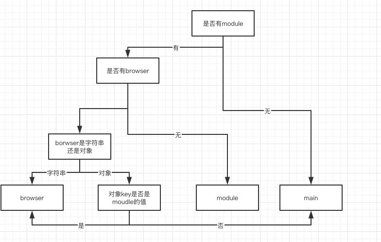

## package.json字段
```
name: 包名
version: 版本号
description: 包的描述
homepage: 项目的地址
author: 包的作者
contributors: 包的参与者们 array
repository: 包代码的Repo信息，包括type/URL,type可以是git或者svn,url则是包的Repo地址
main: require(package.name) 程序主要入口 // 在moudle里会有几个入口的详解
keywords: 包的关键字
bugs: 给了一些联系地址比如url是可以提issue的地方, email是可以给作者发邮件的地方
license: 许可证信息
people fields: 参与者的信息 Array<Object>
files: 模块下的文件名或者文件夹名字
browser: 浏览器入口
bin: 用来添加包的可执行文件
man: 制定一个通过数组制定一些文件来让linux下的man命令查找文档地址
directories: { // CommonJS 通过该属性来制定一些方法描述模块的结构
  lib: 告诉用户 lib 在哪
  bin: 指定了 bin 目录，这个配置下面的文件会被加到 bin 路径下
  man: 指定 man 文件目录
  doc: markdown 文件
  example: 例子
  test: 测试脚本
}
scripts: 脚本执行指令
config: 设置一些项目配置
dependencies: 生产环境依赖包
devDependencies: 开发环境依赖包,
peerDependencies: 同等依赖，用于指定当钱包兼容的宿主版本
bundledDependencies/bundleDependencies: 打包依赖，一个包含依赖包名的数组对象
optionalDependencies: 可选依赖包
engines: 可用其来指定node版本或者npm版本
os: 说明哪个操作系统可以运行
cpu: 说明哪些cpu可以运行
preferGlobal: 表示当用户不将sdk安装为全局模块的时候，需不需要显示警告
private: 如果这个设置了true npm 会拒绝 publish
publishConfig: 发布时使用的配置值
```
## .npmignore
- .gitignore: 防止某些文件上传到git
- .npmignore: 防止某些文件发布出去

里面的写法都一样
## .npmrc
.npmrc可以直接设置npm config 中的值

比如设置源直接在.npmrc中写
```
registry=https://registry.npm.taobao.org/
```
就可以设置源了，而在当前目录下运行npm，规则也会按照.npmrc的规则来进行，而不是使用全局的
## 包的发布和调试
  ### 包的发布
  ```
  npm adduser
  npm login
  npm publish [name] // 如果已经在该源登录了npm账号则可以直接跳过上面两步
  ```
  ### 包的调试
  可以使用 npm link 进行包的测试

  当项目和模块在同一个目录下的时候,在项目目录下运行`npm link ../模块文件夹名`

  当项目和模块不在同一个目录下的时候,模块目录下运行`npm link`进行全局link,然后在项目中`npm link 模块名`

  如果需要解除项目和模块之间的link,项目目录下执行 `npm unlink 模块名`
  如果需要解除模块的全局link, 模块目录下执行`npm unlink 模块名`
## 几个 dependencies 的区别
1. dependencies
2. devDependencies
3. peerDependencies
4. bundledDependencies/bundleDependencies
5. optionalDependencies

这个五个各有各的用处,最熟悉的应该就是 dependencies 和 devDependencies 这两个了，dependencies是项目运行时需要安装的包，当该包的使用者使用该包的时候也会装这里的包，devDependencies是在环境构建或者测试时需要用到的包,该包的使用者使用的时候则不会装这个包。我们下面主要来讲讲后面三种 dependencies
  #### peerDependencies
    同等依赖，或者叫做同伴依赖，用于指定当前包使用的依赖的版本。比如下面是你的package.json
    ```
    {
      // ...
      "dependencies": {
        // ...
        "antd": "^3.26.16",
      },
      "peerDependencies": {
        "antd": "3.x",
      }
    }
    ```
    当外部要用你的包的时候 peerDependencies 就会明确告诉使用方,你需要使用哪个版本的 antd
    > npm1 和 npm2 会自动安装同等依赖，npm3 不再自动安装，会产生警告，需要手动在`package.json`添加依赖项。
  #### bundledDependencies/bundleDependencies
  打包依赖，bundledDependencies是一个包含依赖包名的数组对象，在发布时会将这个对象中的包打包到最终的发布包中。但是这个包必须在 devDependencies 或dependencies 声明过，否则打包会报错。这里就不做例子了因为现在打包都不用 npm pack 了都用 webpack 所以这个没什么用
  #### optionalDependencies
  可选依赖，如果有一些依赖包即使安装失败，项目依然能够运行或者希望 npm 继续运行，就可以使用 optionalDependencies。但是 optionalDependencies 会覆盖 dependencies 中的同名依赖包，所以不要在两个地方都写
## module vs browser vs main
先是几种模块化思想的规范
1. CommonJS (Node环境使用的规范)
2. AMD(Asynchronous Module Definition) 用define的,没用过
3. CMD 和AMD一样都是用define的
4. ESM(ESMA Sctipt Module) ES6的模块化

main: 定义了 npm 包的入口文件, browser 环境和 node 环境均可用
module: 定义 npm 包的 ESM 规范的入口文件, browser 环境和 node 环境均可用
browser: 定义了 npm 包在 browser 环境的入口文件

当CommonJS规范的时候直接走`main`

当ESM规范查找包的时候顺序是

## bin
  package.json 的 bin 属性可以设定可执行文件，当包的使用者安装包的时候，如果安装的包 package.json 中有 bin 字段则会将bin字段下路径的可执行文件软链接到包的使用者的 /node_modules/.bin 中 如果是全局安装包的话就会链接到 /usr/local/bin/

  创建testpackage文件夹 npm init -y 后新建 bin 文件夹, 创建q-cli.js
  ```
  #!/usr/bin/env node
  // #!/usr/bin/env node 这句话的意思是让node执行这个解释程序
  console.log('q-cli123')
  ```
  然后在package.json中加入
  ```
  // package.json
  {
    "bin": {
      "q-cli": "./bin/q-cli.js"
    }
  }
  ```
  在testpackage文件夹下创建testnode文件夹 npm init -y 之后 npm link ../testpackage 之后你就会发现在 node_modules 下有一个.bin文件这个文件下有q-cli.js 这个时候你就可以直接在 testpackage 直接执行 q-cli 命令行则打出了 q-cli123

  例子: 
  1. [包](./testpackage)
  2. [使用者](./testnode)
## npx
老版本的 npm 如果想要调用 node_modules 下的 .bin 文件,命令行下必须 node_modules/.bin/xxx 或者在 package 下的 script 中加运行 npm run xxx 而 npx 就是解决这个问题的 虽然高版本的 npm 现在可以直接命令行调用 xxx 可达到 node_modules/.bin/xxx 的效果,但是 npx 的功能不止于此

1. 在命令行执行本地已经安装的依赖包命令
```
// 这个很简单直接npx就行了
npx xxx
```
2. 不进行全局安装，直接在命令行执行一次性命令
```
// 没想到吧还是 npx xxx
npx create-react-app my-react-app
```
> 这样 npx 会将 create-react-app 下载到一个临时目录，使用之后就会删除，每次运行这个命令都会重新下载依赖包，然后运行完删除

> 可以使用这个功能来使用`http-server`来在当前启动一个Web服务
```
npx http-server // 返回当前文件夹下的index.html
npx http-server -p 3000 // 指定端口
```
运行完 http-server 就会删除
3. 使用不同版本的 node

使用这个功能可以 可以指定 某个版本的 Node 运行脚本。用完之后再删掉
```
npx node@0.12.8 ./test.js 
```
或者使用 -p 参数，这个参数用于指定 npx 所要安装的模块。所以也可以写成这样
```
npx -p node@0.12.8 node ./test.js
```
4. npx 执行 Github 源码
```
npx github:piuccio/cowsay hello
```
> 注意远程代码必须是一个模块,必须包含`package.json`和入口脚本

5. 其他参数

除了 -p 参数 还有很多其他的参数

--no-install 和 --ignore-existing
```
npx --no-install http-server // 不加载远程模块，强制使用本地模块，如果本地没有就报错
```
而 --ignore-existing 正好相反
```
npx --ignore-existing http-server // 不加载本地模块，强制使用远程模块
```
-c 参数
```
npx -p lolcatjs -p cowsay 'cowsay hello | lolcatjs' // 报错
```
因为第一项 cowsay hello 是由 npx 的 cowsay  解释，而第二项是由 shell 的 cowsay 解释，如果全局没有装 cowsay 就报错
```
npx -p lolcatjs -p cowsay -c 'cowsay hello | lolcatjs' // 有了 -c 就可以了
```
-c 的另一个作用就是将是将环境变量带入所要执行的命令。举例来说，npm 提供当前项目的一些环境变量，可以用下面的命令查看。
```
npx -c 'echo "$npm_package_name"'
```
上面会打印出环境变量npm_package_name即包名