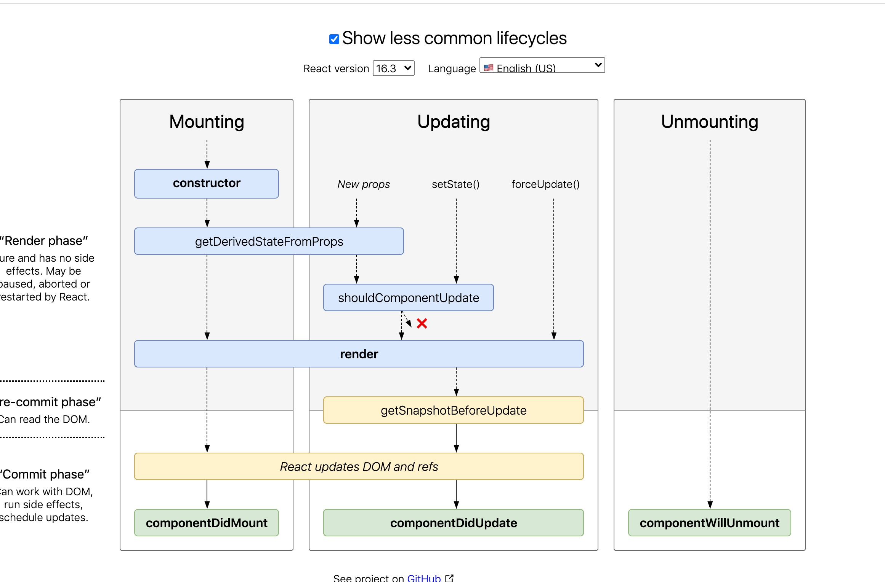
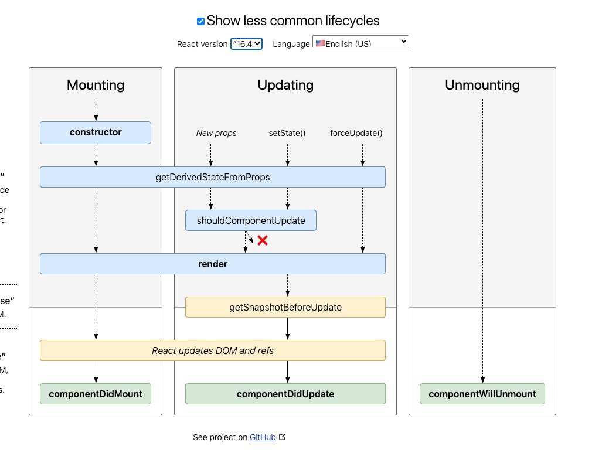

## React的生命周期
1. constuctor(props)
2. static getDerivedStateFromProps(props,state)
3. render()
4. componentDidMount()
5. shouldComponentUpdate(nextProps,nextState)
6. getSnapshotBeforeUpdate(prevProps,prevState)
7. componentDidUpdate(prevProps,prevState,snapshot)
8. componentWillUnmount()

16之后的生命周期都是这些,只不过在16.3之前和之后调用顺序略有改变
### 16.0-16.3
在16.3之前只是将getDerivedStateFromProps在mounting阶段和新传入props时调用,在setState和forceUpdate时不会调用

### 16.3之后

### 错误处理周期
1. componentDidCatch(error,info)
- error: 抛出的错误
- info: 带有componentStack key 的对象,其中包含有关组件引发错误的栈信息
2. static getDerivedStateFromError(error)
### 即将废弃的生命周期及其废弃的原因
1. UNSAFE_componentWillMount()
2. UNSAFE_componentWillUpdate()
3. UNSAFE_componentWillReceiveProps()

废弃的原因是因为在16.0之后react会让运行过长的任务暂停,让浏览器执行完自己的工作,再去执行剩下来的任务,这样是为了防止js操作过长,导致渲染线程卡住太久,卡住图形的渲染,显示就很卡。所有react也因此弄出了一个fiber架构。让dom操作的时候能够暂停,让出时间给浏览器执行自己的任务

而上述即将废弃的生命周期都是可能会卡住react任务,如果上述任务执行太久,接下来有一个优先级很高的任务就无法执行了,比如dom操作,那岂不是凉凉,所以干脆将其废弃