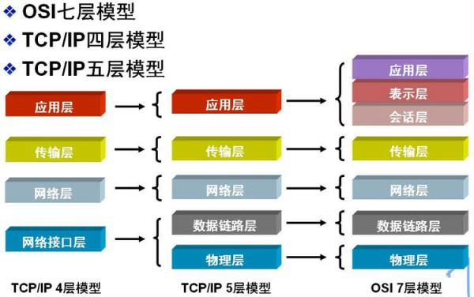
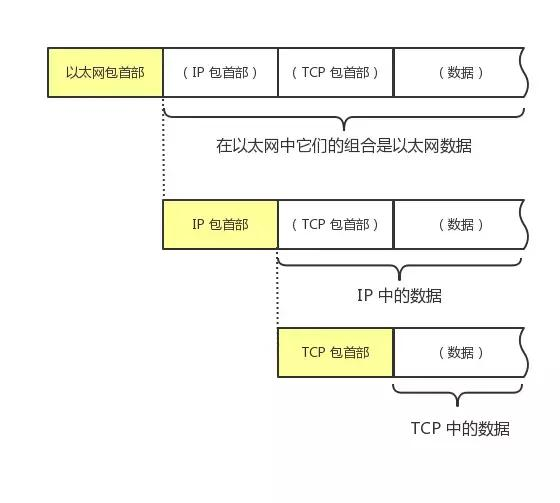
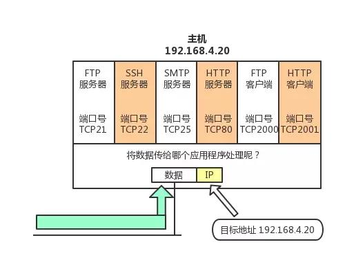
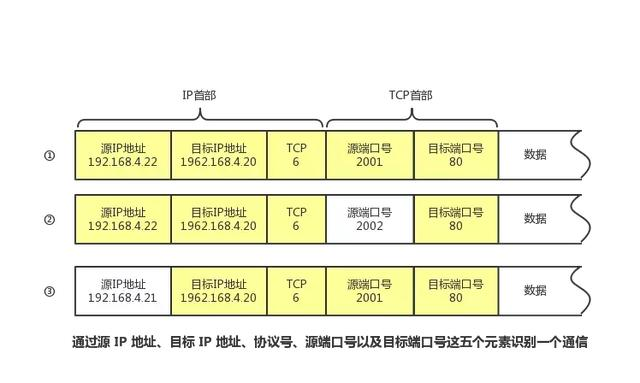

## 七层协议、五层协议和四层协议

1. 七层协议分别为: 物理层、数据链路层、网络层、传输层、会话层、表示层、应用层
2. 五层协议分别为: 物理层、数据链路层、网络层、传输层、应用层(会话层、表示层、应用层)
3. 四层协议非别为: 网络接口层(物理层、数据链路层)、网络层、传输层、应用层(会话层、表示层、应用层)

## 计算机网络体系结构分层

1. 物理层: IS02110/IEEE802/IEEE802.2
2. 数据链路层: SLIP/CSLIP/PPP/ARP/RARP/MTU
3. 网络层: IP/ICMP/RIP/OSPF/BCP/ICMP
4. 传输层: TCP/UDP
5. 应用层: HTTP/TFTP/SNMP/FTP/SMTP/DNS/TELNET

## 数据处理流程
每个分层中,都会对所发送的数据附加一个首部,这个首部中包含了该层必要的信息,如发送的目标地址和协议相关信息。通常为协议提供的信息为包首部,所要发送的内容为数据。在下一层的角度看,从上一层收到的包都被认为是本层的数据。

下图以用户a向用户b发送邮件为例子:

1. 发送端a用户的处理
  - 应用层处理: 应用程序会进行编码处理,编码转化后,邮件不一定马上被发送出去,需要等待连接
  - 传输层处理: TCP根据应用的指示,负责建立连接、发送数据以及断开连接、TCP提供将应用层发来的数据顺利发送到对端的可靠传输
  - 网络层处理: IP将TCP传过来的TCP首部和TCP数据合起来当做自己的数据,并在TCP首部的前端加上自己的IP首部。
  - 数据链路层的处理: 从IP传过来的IP包对于以太网来说就是数据。给这些数据附加上以太网首部进行发送处理,生成的以太网数据包将通过物理层传输给接收端

2. 接收端b用户的处理
  - 数据链路层的处理: 主机收到以太包之后,首先从以太包首部找到MAC地址判断是否是发送给自己的数据,如果不是则丢弃数据,如果是自己的包再传给相应模块。
  - 网络层的处理:IP模块接收到数据后也做类似的处理。从包首部中判断此IP地址是否与自己的IP地址匹配,如果匹配传给下一模块
  - 传输层协议: 首先会计算一下校验和,判断数据是否破坏。然后检查是否在按照序号接受数据。再检查端口号,确定具体的应用程序。数据被完整接受以后,会传给由端口号识别的应用程序
  - 应用层处理: 接收端应用程序会直接接收发送的数据,通过解析数据,展示相应的内容
## 传输的识别
数据链路层和IP中的地址分别为MAC地址和IP地址。前者用来识别同一链路中不同的计算机,后者用来识别TCP/IP网中互联的主机和路由器

1. 端口号: 一台计算机上可以同时运行多个程序,传输层协议就是利用这些端口号识别本机中正在进行通信的应用程序。

2. 通过IP地址、端口号、协议号进行通信识别: 仅凭一个端口号是不能进行通信的还要通过协议号、IP地址来进行通信识别

3. 端口号和协议
  - 端口号由其使用的传输层协议决定。因此,不同的传输层协议可以使用相同的端口号。
  - 此外,那些知名端口号与传输层协议并无关系。只要端口一致都将分配同一种应用程序进行处理。