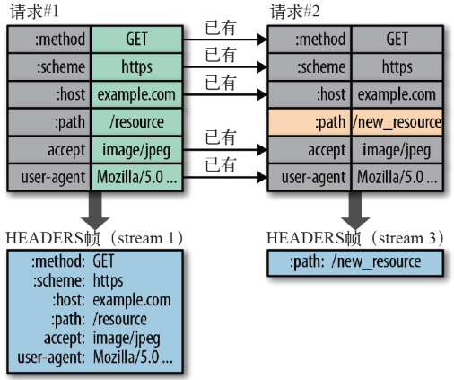

## http
HTTP协议是 HyperText Transfer Protocol(超文本传输协议)的缩写, 它是互联网上应用最为广泛的一种网络协议。所有的 WWW 文件都必须遵循这个标准。

并且http请求由三部分构成
- 请求行
- 首部
- 实体

请求行`GET /images/logo.gif HTTP/1.1`,大概由请求方法、URL、协议版本组成
### http请求方法
请求方法分很多种,最常用的就是`get`和`post`了。那这两种方法有什么不同呢？

首先引入副作用和幂等的概念
1. 副作用指对服务器上的资源做改变,搜索是无副作用的,注册是副作用的
2. 幂等指发送 M 和 N 次请求(两者不同且大于1), 服务器上的资源状态一致, 比如注册 10 个和 11 个账号是不幂等的(服务器多了一个账号),对文章修改 10 次和 11 次是幂等的(服务器只是更新同一个资源)

所以
1. 在规范上说: Get多用于无副作用,幂等的情景,例如搜索关键字。post多用于副作用,不幂等的场景,比如注册
2. 在技术上说: 
  - Get 请求能缓存,Post 不能(有些浏览器会做处理)
  - Post相对于Get安全一点,因为Get请求都包含在URL中,并且会被浏览器保存历史记录。Post不会
  - 浏览器URL有长度限制,会影响GET传参
  - Post有更多的编码格式且不对数据类型限制
### http1.0/1.1 的区别
- 缓存处理: 在HTTP1.0中主要使用header中的 If-Modified-Since 和 Expires来作为缓存的标准,HTTP1.1引入了If-None-Math、ETag等更多可供选择的缓存头来控制缓存策略
- 带宽优化和网络连接的使用: HTTP1.1请求头中引入了range头域,允许之请求资源的某个部分,状态码返回206
- 错误通知的管理: HTTP1.1新增了24个错误状态响应码
- Host头的处理: 在HTTP1.0中认为每台服务器都绑定一个唯一的IP地址,因此请求消息中的URL并没有传递主机名(hostname)。但随着虚拟主机技术的发展, 在一台物理机上可能存在多台虚拟主机,并且他们共享一个IP地址。HTTP1.1的请求消息和响应消息都应支持Host头域,且请求消息中如果没有Host透雨会报400
- 长连接: HTTP1.1支持`Connection: keep-alive`一定程度弥补了HTTP1.0每次请求都要创建连接的缺点
### http1.x 的缺陷
- 连接无法复用: 连接无法复用会导致每次请求都要经历三次握手和慢启动。三次握手在高延迟的场景下影响较明显,慢启动则对大量小型文件请求影响较大(没有达到最大窗口就被终止)
   - HTTP/1.0 传输数据时,每次都需要重新建立连接,增加延迟。
   - HTTP/1.1 虽然加入了keep-alive可以复用一部分连接, 但域名分片等情况仍然需要建立多个 connection, 耗费资源, 给服务器带来性能压力。并且Keep-Alive的复用是串行的,复用的Http请求只有等上一个Http请求结束之后才能进行。这样一个请求延时了会影响到所有请求
- HTTP1.x 使用时,header携带的内容过大,一定程度上增加了传输的成本,并且每次请求header基本不变化,会增加很多不必要的流量
- 传输都是明文,客户端和服务端无法验证对方身份,无法保证安全性
- Head-Of-Line Blocking(HOLB线头阻塞): 导致带宽无法被充分利用, 以及后续健康请求被阻塞.
   - http/1.0: 下个请求必须在前一个请求返回后才能发出,request-response对序发生。显然如果上个请求长时间没返回那么接下来的请求全部阻塞了。
   - http/1.1: 尝试使用pipeling来解决,即浏览器可以一次性发多个请求(同个域名,同一条TCP链接)。但pipeling要求返回是按序的,那么前一个请求如果很耗时,那么后面的请求即使服务器已经处理完,仍然会等待前面的请求处理完才开始按序返回。
### SPDY
2020年Google提出了SPDY(发音同"speedy")的方案,它综合了HTTPS和HTTP两者优点主要解决
- 减低延时(多路复用): 多路复用通过多个请求stream共享一个TCP连接的方式,降低多个TCP的延迟提高了带宽的利用率
- 请求优先级: 多路复用带来的新问题是,在连接共享基础之上可能有重要请求被阻塞,所以允许给每个请求设置优先级
- header压缩: 可以压缩头部
- 基于HTTPS的加密传输协议: 保留了HTTPS的TLS加密特性,提高了传输数据的可靠性
- 服务端推送: 比如请求index.html会将index.js推送给客户端,当客户端尝试获取的时候就可以直接使用缓存了。

SPDY协议在谷歌浏览器上证明可行之后,就被当做了HTTP/2的基础,主要特性都在HTTP/2之中得到继承
### http2.0
概念
- 流: 流是连接中的虚拟通道,可以承载双向的消息,每一个流都有一个唯一的整数标识符
- 消息: 是逻辑上的http消息,比如请求、响应等,由一个或多个帧组成
- 帧: http2.0通信的最小单位,没个帧包含首部,至少也会标识出当前帧所属的流,承载这特定类型的数据,比如HTTP首部、负荷等等

首先http2.0协议本身没有要求必须基于https部署,但是因为下面的原因,http2.0和https几乎都是捆绑在一起的
- http 数据明文传输,数据很容易被中间节点窥视或篡改,https可以保证数据传输的保密性、完整性和不被冒充
- 因为https对中间节点的保密,所以具有更好的连通性。基于https部署的新协议具有更高的连接成功率
- 当前主流浏览器只支持基于https部署的http2

新特性
- 二进制分帧: 采用二进制传输而非http1.x的文本格式,二进制协议解析起来更高效。HTTP/1的请求和响应报文,都是由起始报文,首部和实体正文组成,各部分由文本换行符分割。HTTP2将请求和响应数据分割为更小的帧,并且它们采用二进制编码。

- 多路复用: 多路复用很好的解决了浏览器限制同一个域名下请求数量的问题,通知也接更容易实现全速传输,毕竟每次三次握手之后都要慢开始
   - 一个域名对应一个连接
   - 一个流代表了一个完整的请求响应过程
   - 帧是最小的数据单位,每个帧会标识出该帧属于哪个流,流也就是多个帧组成的数据流。
   - 多路复用就是在一个TCP连接中可以存在多个流

- 头部压缩: 因为在http1.x中每次文本传输头部都需要重复传几百到上千个字节,很浪费资源,所以http2采用了头部压缩策略
   - http/2在客户端和服务端使用'首部表'来跟踪和储存之前发送的键值对,对于相同的数据,不再通过每次请求和响应发送
   - 首部表在HTTP/2的连接存续期内始终存在,由客户端和服务器共同渐进地更新
   - 每个新的首部键-值对要么被追加到当前表的末尾,要么替换表之前的值

- 服务器推送(Server Push): 服务器能通过 push 的方式将客户端需要的内容预先推送过去, 也叫"cache push".比如请求html时,先把js/css推送过去缓存,当html加载css/js时就不用去请求而是直接使用缓存,服务端可以主动推送,客户端也有权利选择是否接收。如果服务端推送的资源已经被浏览器缓存过,浏览器可以发RST_STREAM帧来拒收。主动推送也遵守同源策略。

### http2和http1.x的区别
1. 二进制分帧: http1.x是基于文本分割的协议,http/2是基于二进制帧的协议。
2. 多路复用: 为什么HTTP1.x不能实现多路复用呢,原因也是因为http2进行了二进制分帧。http1.x是根据发送消息的换行分割符来判断每一条key:value
   - 所以http1.x一次只能处理一个请求或响应,因为这种以分割符分割消息的数据,在完成之前不能停止解析
   - http1.x解析这种数据无法预知需要多少内存,这会给"服务端"很大的压力,因为它不知道要把一行要解析的数据读到多大的缓冲区中,在保证解析效率和速度的前提下内存该如何分配
   - http2二进制分帧实现了一个目的:一切可预知,一切可控,因为帧是一个数据单元实现了对消息的封装。所以可以实现多路复用疯狂发帧就行了

http1.x文本
```
GET / HTTP/1.1
Accept:text/html,application/xhtml+xml,application/xml;q=0.9,image/webp,image/apng,*/*;q=0.8
Accept-Encoding:gzip, deflate, br
Accept-Language:zh-CN,zh;q=0.9,en;q=0.8
Cache-Control:max-age=0
Connection:keep-alive
Cookie:imooc_uuid=b2076a1d-6a14-4cd5-91b0-17a9a2461cf4; imooc_isnew_ct=1517447702; imooc_isnew=2; zg_did=%7B%22did%22%3A%20%221662d799f3f17d-0afe8166871b85-454c092b-100200-1662d799f4015b%22%7D; loginstate=1; apsid=Y4ZmEwNGY3OTUwMTdjZTk0ZTc4YzBmYThmMDBmZDYAAAAAAAAAAAAAAAAAAAAAAAAAAAAAAAAAAAAAAAAAAAAAAAAAAAAAAAAAAAAAAAAAAAAAAAAAAAAAAAAAAAAANDEwNzI4OQAAAAAAAAAAAAAAAAAAAAAAAAAAAAAAAAA5NTMzNjIzNjVAcXEuY29tAAAAAAAAAAAAAAAAAAAAADBmNmM5MzczZTVjMTk3Y2VhMDE2ZjUxNmQ0NDUwY2IxIDPdWyAz3Vs%3DYj; Hm_lvt_fb538fdd5bd62072b6a984ddbc658a16=1541222935,1541224845; Hm_lvt_f0cfcccd7b1393990c78efdeebff3968=1540010199,1541222930,1541234759; zg_f375fe2f71e542a4b890d9a620f9fb32=%7B%22sid%22%3A%201541297212384%2C%22updated%22%3A%201541297753524%2C%22info%22%3A%201541222929083%2C%22superProperty%22%3A%20%22%7B%5C%22%E5%BA%94%E7%94%A8%E5%90%8D%E7%A7%B0%5C%22%3A%20%5C%22%E6%85%95%E8%AF%BE%E7%BD%91%E6%95%B0%E6%8D%AE%E7%BB%9F%E8%AE%A1%5C%22%2C%5C%22%E5%B9%B3%E5%8F%B0%5C%22%3A%20%5C%22web%5C%22%7D%22%2C%22platform%22%3A%20%22%7B%7D%22%2C%22utm%22%3A%20%22%7B%7D%22%2C%22referrerDomain%22%3A%20%22%22%2C%22cuid%22%3A%20%22Jph3DQ809OQ%2C%22%7D; PHPSESSID=h5jn68k1fcaadn61bpoqa9hch2; cvde=5be7a057c314b-1; IMCDNS=1
Host:www.imooc.com
Referer:https://www.imooc.com/
Upgrade-Insecure-Requests:1
User-Agent:Mozilla/5.0 (Windows NT 6.1; WOW64) AppleWebKit/537.36 (KHTML, like Gecko) Chrome/63.0.3239.132 Safari/537.36
```
http2.0帧结构


### http3.0简介
虽然HTTP/2解决了很多旧版本的问题,但是还是存在巨大问题,那就是主要是底层是TCP。
- 虽然有了多路复用,一般来说一个域名只要一个TCP连接。但是如果连接中出现了丢包的情况,那整个TCP都要等待重传,也导致了后面所有数据都会被阻塞。
- 因为TCP存在时间太长用的人太多,不太好修改,所以Google弄了一个基于UDP协议的QUIC协议,并且使用在了HTTP/3上
- 并且QUIC安全层同样适用TLS1.3协议
### http3.0新功能
- 改进的拥塞控制、可靠传输:
- 快速握手
- 集成了 TLS1.3 加密
- 多路复用
- 连接迁移
