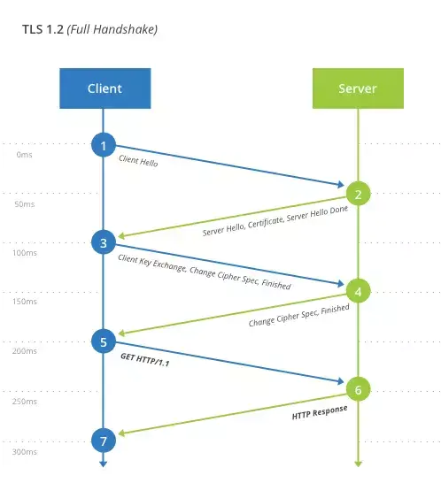

## https
主要作用:
- 对数据进行加密,建立一个信息安全通道,来保证传输过程的数据安全
- 对网站服务器进行真实身份认证

使用原因:
- http明文通信内容可能被窃听
- http协议无法证明报文的完整性,可能被篡改
- http不验证通信方的身份,有可能遭遇伪装

https优势
- 数据隐私性: 内容经过对称加密,每一个连接生成一个唯一密钥
- 数据完整性: 内容传输经过完整性校验
- 身份认证: 第三方无法伪造服务端(客户端)身份

### https如何解决上述问题
https并不是应用层协议,只是http通信接口部分用SSL/TLS协议代替而已。

https协议主要功能基本都依赖于 TLS/SSL 协议, TLS/SSL 的功能实现主要依赖于三类基本算法: 散列函数、对称加密和非对称加密, 其利用非对称加密实现身份认证和密钥协商,对称加密算法采用协商的密钥对称加密,基于散列函数验证信息的完整性

#### 1. 解决内容可能被窃听的问题---加密

- 对称加密: 这种方法加密和解密同用一个密钥。加密和解密都会用到密钥。没有密钥无法对密码解密,但是任何人有了密钥就能解密了。但是如何让两方知道密钥, 因为一旦密钥被截获就没有加密的意义了
- 非对称加密: 公开密钥加密使用一对非对称的密钥。一把叫做私有密钥,另一把叫做公开密钥。创建连接时只需要交换公钥,随后一方发送数据使用另一方的公钥加密传输,对方收到加密信息之后再用自己的私钥进行解密。但是这种方式有缺点:
   - 公钥不包含服务器信息,使用非对称加密算法无法保证服务器身份合法性,存在中间人攻击风险,服务器发送客户端公钥传送过程中可能会中间人截获并且篡改
   - 使用非对称加密在数据加密解密过程中需要消耗时间,降低数据传输效率
- 对称加密+非对称加密(https采用这种方式): 先使用非对称加密获取对称加密的密钥,之后通信过程中使用对称加密的密钥

#### 2. 解决报文可能遭篡改问题--数字签名

网络中需要很多中间节点,虽然数据无法被解密,但是可能被篡改,那么如何校验数据的完整性呢？那就可以校验数字签名

数字签名有两种功效
- 确定消息确实是发送方签名并发出来的,因为别人假冒不了发送方的签名。
- 数字签名能确定消息的完整性,证明数据是否未被篡改过

数字签名生成:

将一段文本用Hash函数生成消息摘要,然后用发送者的公钥加密生成数字签名,和原文一起传送给接受者。

校验数字签名:

接受者用自己的私钥解密消息,然后用HASH函数对收到的原文产生一个摘要信息,将这个信息和上一次得到的摘要信息对比。如果相同,说明是完整的,在传输过程中没有被修改,否则说明信息被修改过,所以数字签名可以验证消息的完整性。

#### 3. 解决对方身份可能被伪装的问题---数字证书
数字证书认证机构处于客户端和服务器双方都可信赖的第三方机构的立场上

流程:
- 服务器的运营人员向第三方机构CA提交公钥、组织信息、个人信息(域名)等信息并申请认证;
- CA通过线上、线下等多种手段验证申请者提供信息的真实性, 如组织是否存在、企业是否合法,是否拥有域名的所有权等;
- 如果信息审核通过,CA回向申请者签发认证文件-证书。证书包含以下信息: 申请者公钥、申请者组织信息和个人信息、签发机构CA的信息、有效时间、证书序列号等信息的明文,同时包含一个签名。其签名的产生算法: 首先, 使用散列函数计算公开明文信息的信息摘要,然后采用CA私钥对信息摘要进行加密,密文即是签名;
- 客户端向服务器发送请求,服务器返回证书
- 客户端读取证书中的相关的明文信息, 采用相同散列函数计算得到信息摘要,然后利用对应CA公钥解密签名数据,对比证书的信息摘要,如果一致,可以确认证书的合法性
- 客户端还会验证证书相关的域名信息、有效时间信息等;客户端会内置信任CA的证书信息,如果CA不被信任,会判定为非法
### TLS握手

1. client_hello: 客户端发起请求,从明文传输请求信息,包含版本信息,加密套件候选列表,压缩算法候选列表,随机数,扩展字段等信息
   - 支持的最高TSL协议版本version,从低到高依次为 SSLv2/SSLv3/TLSv1/TLSv1.1/TLSv1.2 当前基本不再使用低于TLSv1的版本
   - 客户端支持的加密套件clipher suites列表,每个加密套件对应前面TLS原理中的四个功能的组合: 认证算法Au(身份验证)、密钥交换算法、对称加密算法、和信息摘要Mac
   - 支持的压缩算法 compression methods列表, 用于后续的信息压缩传输
   - 随机数 Random_C,用于后续的对称密钥生成
   - 扩展字段 extensions, 支持协议与算法的相关参数和其他辅助信息等,常见的SNI就属于扩展字段。
2. Server_hello + server_certificates + server_hello_done
   - server_hello, 服务端返回协商的信息结果,包括选择使用的协议版本 version,选择的加密套件 cipher suite,选择的压缩算法 compression method、数 random_S 等,其中随机数用于后续的密钥协商
   - server_cartificates, 服务器端配置对应的证书链,用于身份验证与密钥交换
   - server_hello_done, 通知客户端 server_hello 信息发送结束
3. 证书验证: 客户端验证证书的合法性,如果验证通过才会进行后续通信,否则根据错误不同做出提示和操作,合法性验证包括如下:
   - 证书链的可信性 trusted certificate path,
   - 证书是否吊销 revocation, 有两类方式离线 CRL 与在线 OCSP,不同客户端行为会不同
   - 有效期 expiry date, 证书是否在有效时间范围
   - 域名 domain, 核查证书域名是否与当前访问域名匹配。
4. client_key_exchange + change_cipher_spec + encrypted_handshake_message
   - client_key_exchange: 合法性验证通过之后, 客户端计算产生随机数字 Pre-master, 并用证书公钥加密,发送给服务器,此时客户端已经获取全部的计算协商密钥需要的信息: 两个明文随机数 random_C 和 random_S 与自己产生的 Pre-master, 计算得到协商密钥;enc_key=Func(random_C,random_S,Pre_master)
   - change_cipher_spec: 客户端通知服务器后续的通信都采用协商的通信密钥和加密算法进行加密
   - encrypted_handshake_message: 结合之前的所有通信参数hash值与其他相关信息生成一段数据,采用协商密钥 session secret 与算法进行加密,然后发送给服务器用于数据和握手验证
5. change_cipher_spec + encrypted_handshake_message
   - 服务器用私钥解密加密的 Pre-master 数据, 基于之前交换的两个明文随机数 random_C 和 random_S,计算得到协商密钥
   - change_cipher_spec, 验证过后,服务器同样发送 change_cipher_spec 以告知客户端后续的通信都采用协商的密钥与算法进行加密通信
   - encrypted_handshake_message, 服务器也结合所有当前的通信参数信息生成一段数据并采用协商密钥session secret与算法加密发送到客户端
6. 握手结束: 客户端计算所有接收信息的hash值,并采用协商密钥解密 encryped_handshake_message, 验证服务器发送的数据和密钥,验证通过则握手完成
7. 加密通信: 开始使用协商密钥与算法进行加密通信
   - 服务器也可以要求验证客户端,即双向验证,可以在过程2要发送 client_certificate_request 信息, 客户端在过程4中先发送 client_certificate 与 certificate_verify_message 信息,证书的验证方式基本相同。
   - 根据使用的密钥交换算法的不同,协商细节略有不同
### TLS会话缓存握手过程
为了加快建立握手的速度,减少协议带来的性能降低和资源消耗,TLS协议有两类会话缓存机制: 会话标识 sessionID 与 会话记录 session ticket

sessionID 由服务器支持,协议中的标准字段,因此基本所有服务器都支持,服务器保存会话ID以及协商的通信信息。占用服务器资源较多

session ticket 需要服务器和客户端都支持,属于一个扩展字段,将协商的通信信息加密后发送给客户端保存,密钥只有服务器知道,占用服务器资源较少

两者类似于http的session与cookie

两者都存在的情况下,优先使用session_ticket.

1. 会话标识 sessionID
   - 如果客户端和服务器之间曾经建立了连接,服务器会在握手成功之后返回 sessionID,并保存对应的通信参数在服务器中
   - 如果客户端再次需要和该服务器建立连接,则在client_hello和sessionID中携带记录的信息,发送给服务器
   - 服务器根据收到的sessionID检索记录,如果没有检索到缓存或者过期,则按照正常的握手过程进行
   - 如果检索到对应的缓存且缓存没有过期,那么返回change_cipher_spec与encrypted_handshake_message信息,两个信息作用类似,encrypted_handshake_message 是到当前的通信参数与 master_secret 的 hash值
   - 如果客户端能够验证通过服务器加密数据,则客户端同样发送 change_cipher_spec 与 encrypted_handshake_message信息
   - 服务器验证数据通过,则握手建立成功,开始正常的加密数据通信
2. 会话记录 session ticket
   - 如果客户端和服务器之间曾经建立了连接,服务器会在 new_session_ticket 数据中携带加密 session_ticket 信息,客户端保存;
   - 如果客户端再次需要和该服务器建立连接,则在 client_hello中扩展字段 session_ticket中携带加密信息,一起发送给服务器;
   - 服务器解密 session_ticket 数据,如果解密失败则按照正常的握手进行
   - 如果解密成功, 则返回 change_cipher_spec 与 encrypted_handshake_message 信息,两个信息作用与 sessionID 中类似
   - 如果客户端能够验证通过服务器加密数据,则客户端同样发送 change_cipher_spec 与 encrypted_handshake_message信息
   - 服务器验证数据通过则握手成功,正常开始加密数据通信
### TLS重建连接
重建连接 renegotiation 即放弃正在使用的 TLS 连接, 从新进行身份认证和密钥协商过程,特点是不需要断开当前的数据传输就乐意重新身份认证、更新密钥或算法,因此服务器端储存和缓存的信息都可以保持。客户端和服务器都能够发起重建连接的过程

1. 服务器重建连接
- 客户端和服务器之间建立的了有效的TLS连接并通信
- 客户端访问受保护的信息
- 服务器端返回 hello_request 信息
- 客户端收到 hello_request 消息之后发送 client_hello 信息, 开始重新建立连接

2. 客户端重建连接: 客户端重建连接一边是为了更新通信密钥
- 客户端和服务器之间建立了有效TLS连接并通信
- 客户端需要更新密钥, 主动发出 client_hello 信息
- 服务器收到 client_hello 信息之后无法立即识别出该信息非应用数据,因此会提交给下一步处理,处理完之后会返回通知该信息为要求重建连接
- 在确定重建连接之前,服务器不会立即停止向客户端发送数据,可能恰好同时或有缓存数据需要发送给客户端,但是客户端不会再发送任何消息给服务器
- 服务器识别出重建连接请求之后,发送server_hello信息到客户端
- 客户端也无法立即判断出该信息非应用数据,同样交给下一步处理,处理之后会返回通知该信息为要求重建连接
- 客户端和服务器开始新的重建连接的过程