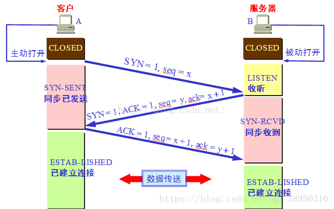
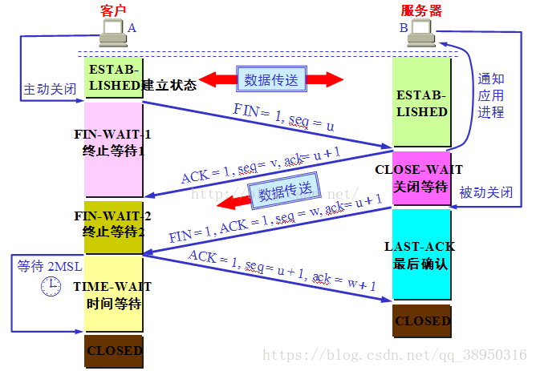
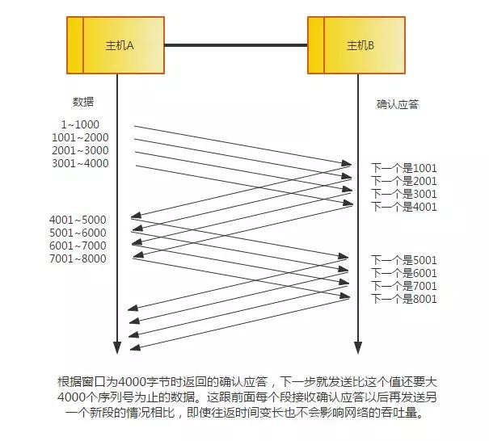
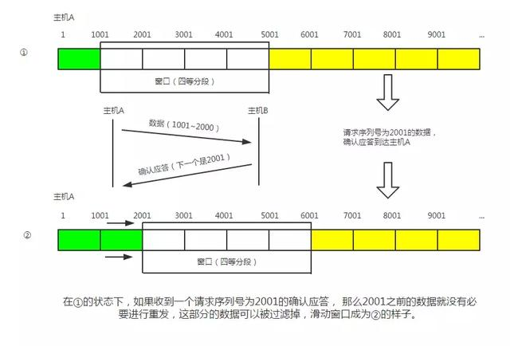
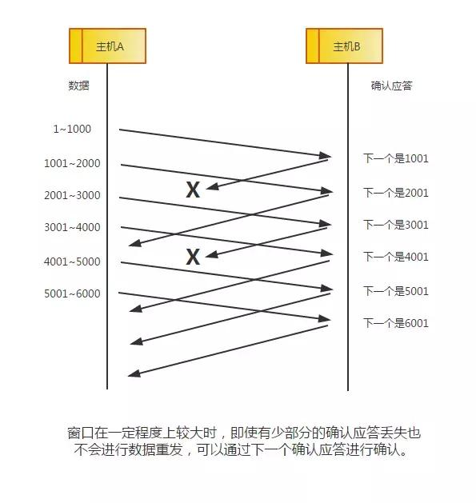
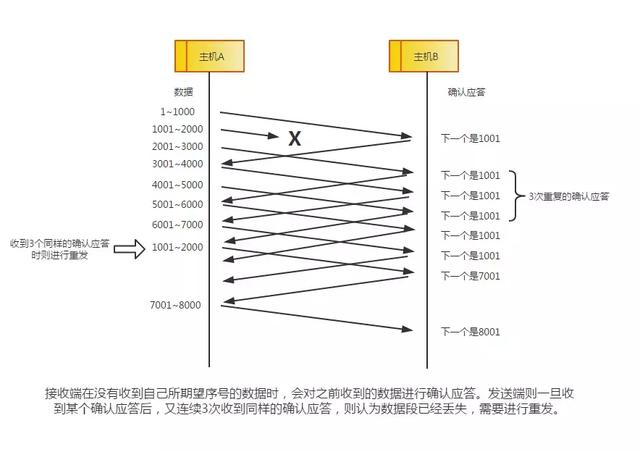

## tcp
- TCP 和 UDP的区别相当大。它充分的实现了数据传输时的各种控制功能,可以进行丢包时的重发控制,可以堆次序乱掉的包进行顺序控制。而这些在UDP中都没有。
- 此外,TCP作为一种面向有连接的协议,只有在确认通信对端存在时才会发送数据,从而可以控制通信流量的控制
- 根据TCP这些机制,在IP这种无连接的网络上也能实现高可靠性的通信(主要通过校验和、序列号、确认应答、重发控制、连接管理以及窗口控制等机制实现)

### TCP头部
对于TCP头部来说,有几个很重要的字段

- Sequence number(seq): 这个序号保证了TCP传输的报文都是有序的,对端可以通过序号顺序的拼接报文
- Acknowledegment number(ack): 这个需要表示接受端期望接收的下一个字节的编号是多少,同时也表示上一个序号的数据已经收到,这个值是上个服务端的包的 Sequence number + 1
- Window Size: 窗口大小,表示还能接受多少字节的数据,用于流量控制
- 标识符
   - SYN = 1: 当 SYN=1,ACK=0时, 说明是一个请求报文, 当 SYN=1,ACK=1时说明是一个同意建立连接的应答报文 
   - ACK = 1: 当 ACK=1 时表示确认号字段有效。此外, TCP还规定在连接后所有报文段都必须把ACK=1
   - FIN = 1: 该字段表示此报文是一个释放连接的请求报文
   - URG = 1: 该字段为1时, 表示本数据报的数据部分含紧急信息, 是一个高优先级的数据报文, 此时紧急指针有效。紧急数据一定位于当前数据包的最前面, 紧急指针标明了紧急数据的尾部
   - PSH = 1: 该字段为1时, 表示接收端应该立即将数据 push 给应用层,而不是等到缓冲区满后再提交。
   - RST = 1: 该字段为1时, 表示当前TCP连接出现严重问题,需要重新建立TCP连接, 也可以用于拒绝非法报文段和拒绝连接的请求

### 状态机
HTTP是无连接的,所以作为下层的TCP协议也是无连接的,虽然看似TCP将两端连接了起来,但是其实只是两端共同维护了一个状态。

#### 三次握手建立连接
首先三次握手的原因: 避免失效的报文被服务端接受,从而产生错误。因为如果两次就可以的话,存在第一次握手因为网络延时,引发了客户端超时重传,这个时候第二次握手之后就开始了传输,而在传输过程中如果网络延时的包到了,服务器又会以为是有一个新的连接,所以重新发一个第二次握手的包之后开始传输数据,而这次传输的数据是不必要的,这样会造成资源的浪费,所以我们需要第三次握手来确认这次传输的数据是需要的。

首先客户端和服务端都是 CLOSE 状态

- 第一次握手: 客户端给服务端发送一个 SYN=1,seq=x 的数据包来建立连接,此时客户端的状态变为 SYN-SENT(同步已发送)
- 第二次握手: 当服务端收到第一次握手的数据包后, 将发送一个 SYN=1,ACK=1,seq=j,ack=x+1 的数据包来答复, 此时服务端的状态变为 SYN_RCVD(同步收到)
- 第三次握手: 当客户端收到第二次握手的数据包时, 将发送一个 ACK=1,seq=x+1,ack=j+1 的数据包来答复, 此时客户端的状态变为 ESTAB_LISTED(已经建立连接) 而服务端收到第三次握手的包之后也进入 ESTAB_LISTEND 的状态,自此连接创建完毕开始传输数据

从此时之后到连接结束所有的包的ACK都为1,感觉这像一个答复字段,答复你收到消息了,而seq和ack的存在也保证了数据包的有序存在。

#### 四次挥手
会有四次挥手的原因: 发送关闭连接的一方收到关闭消息之后,需要答复,而答复之后可能还会有数据包没发送完需要发送,等发送完则发送,关闭连接的数据包,再次答复,则有了四次挥手

挥手前客户端和服务器端都是 ESTAB_LISTED 状态
- 第一次挥手: 客户端发送 FIN=1,seq=u的数据包,此时客户端的状态变为 FIN_WAIT_1
- 第二次挥手: 服务器收到消息之后发送一个 ACK=1,seq=k,ack=u+1的数据包,服务器的状态变为CLOSE_WAIT,随后服务器开始发送还未发送完的数据
- 第三次挥手: 当服务器发送完最后的数据后,会发送一个FIN=1,seq=u+1,ack=k+1的数据包,告诉客户端需要关闭连接,此时服务器端的状态变为 LAST_ACK
- 第四次挥手: 当收到第三次挥手的数据包后,发送一个ACK=1,seq=k+1,ack=u+2的数据包,告诉客户端可以进行关闭连接,此时客户端进入TIME_WAIT状态,等待2ms之后客户端变为CLOSE状态,而服务器收到第四次挥手的数据包后就直接变为了CLOSE状态

等待2MSL的原因是因为害怕服务器没有收到关闭的确认消息而导致一直无法关闭连接的状态,所以等待2MSL,这2MSL是两倍的最长报文段的寿命。

MSL: 最长报文段寿命,在网络上存在的最长时间,超过这个时间报文将被丢弃。

2MSL:

### ARQ协议
ARQ协议就是超时重传机制。通过确认和超时机制保证了数据的正确送达,ARQ协议包含停止等待ARQ和连续ARQ两种协议
#### 停止等待ARQ
1. 正常传输过程

只要 A 向 B 发送一段报文, 都要停止发送并启动一个定时器, 等待对端回应, 在定时器时间内接收到对端应答就取消定时器并发送下一段报文。

2. 报文丢失或出错

在报文传输的过程中可能会出现丢包.这时候超过定时器设定的时间就会再次发送丢失的数据直到对端响应,所以需要每次都备份发送的数据。

即使报文正常的传输到对端, 也可能出现在传输过程中报文出错的问题。这个时候对端会抛弃该报文并等待 A 端重传

> 一般定时器设定的时间都会大于一个 RTT 的平均时间

3. ACK 超时或丢失
对端传输的应答也可能出现丢失或超时的情况。那么超过定时器时间 A 端照样会重传报文。这时候 B 端收到相同序号的报文会丢弃该报文并重传应答, 直到 A 端发送下一个序号的报文。

在超时的情况下也可能出现应答很迟到达,这时 A 端会判断该序号是否已经接收过,如果接收过只需要丢弃应答即可。

这种等待ARQ肯定不是一个高效的方式。在良好的网络环境中,每次都要等待肯定是不能接收的,所以就有了连续ARQ这种高效的协议

#### 连续ARQ
在连续ARQ中, 发送端拥有一个发送窗口, 可以在没有收到应答的情况下持续发送窗口内的数据, 这样相比停止 ARQ 来说减少了等待时间, 提高了效率。

1. 累计确认

连续 ARQ 中,接收端会持续不断收到报文.如果和停止 ARQ 中接收一个报文就发送一个应答一样,就太浪费资源了。通过累计确认, 可以在收到多个报文后统一回复一个应答报文。 报文中的ack标志位可以用来告诉发送端这个序号之前的数据已经全部接收到了,下次请发送这个序号之后的数据

但是累计确认也有一个弊端。在连续接收报文时, 可能会遇到接收到序号 5 的报文后,并没有接收到6的报文,但是7之后的报文都已经收到了,这个时候ack就只能回复6,这样就会造成重复发送数据的情况。

;
### 滑动窗口
在连续ARQ中谈到了发送窗口,而在TCP中,两段都维护着窗口: 分别为发送窗口和接收端窗口。发送端窗口包括已发送但未收到应答的数据和可以发送但是未发送的数据。

发送窗口是由接收窗口剩余大小决定的。接收方会把当前接收窗口的剩余大小写入应答报文,发送端接收到应答后根据该值和当前网络拥塞情况设置发送窗口的大小,所以发送窗口的大小是不断变化的。

当发送端收到应答报文后,会随之将窗口进行滑动

;

滑动窗口是一个很重要的概念, 它帮助 TCP 实现了流量控制的功能。接收方通过报文告知发送方还可以发送多少数据,从而保证接收方能够来得及接收数据,防止出现接收方带宽已满,但是发送方还一直发送数据的情况。

> 在发送报文的过程中, 可能会遇到对端出现零窗口的情况。在该情况下, 发送端会停止发送数据,并启动 persistent timer。该定时器会请示请求给对端,让对端告知窗口大小。在重试一定次数之后,可能会中断TCP连接。

如果在滑动窗口中虽然有确认应答消息中有包丢失,发送端会根据确答的下一个包确认上个包是否收到

但是如果发送端发送的包丢失之后就会触发快速重传
### 拥塞控制
拥塞控制和流量控制不同,后者是作用于接收方,保证接收方来得及接收数据。而前者是作用于网络,防止过多的数据拥塞网络,避免出现网络负载过大的情况。

拥塞处理包括了四个算法, 分别为: 慢开始/拥塞避免/快速重传/快速恢复。

1. 慢开始算法: 慢开始算法,顾名思义,就是在传输开始时将发送串口慢慢指数级扩大,从而避免一开始就传输大量数据导致网络拥塞。具体步骤如下
- 链接初始设置拥塞窗口为1MSS(一个分段的最大数据量)
- 每过一个RTT(一个往返时延)就将窗口的大小乘2
- 指数级增长肯定不能没有限制,所以有一个阈值限制,当窗口大小大于阈值时就会启动拥塞避免算法
2. 拥塞避免算法: 拥塞避免算法比较简单,每过一个RTT窗口大小只加1,这样就能够避免指数级增长导致网络拥塞,慢慢将大小调整到最佳值,而当传输过程中如果出现了定时器超时,TCP就会认为网络拥塞了,就会马上进行以下步骤
- 将阈值设为当前拥塞窗口的一半
- 将拥塞窗口设置 1MSS
- 启动拥塞避免算法
3. 快速重传: 快速重传一般和快速恢复一起出现。一旦接收端收到的报文出现失序的情况,接收端只会回复最后一个顺序正确的报文。如果发送端收到三个重复的ACK,无须等待定时器超时而是直接启动快快速重传算法。具体的算法分为两种
- TCP Taho 实现:1. 将阈值设为当前拥塞窗口的一半。2. 将拥塞窗口设为1MSS。3. 重新开始慢开始算法
- TCP Reno 实现:1. 拥塞窗口减半。2. 将阈值设为当前拥塞窗口。3. 进入快恢复阶段(重发对端需要的包,一旦受到一个新的ACK答复就退出该阶段),这种方式在丢失多个包的情况下就没有那么好用了。4. 使用拥塞避免算法 

4. 改进后的 TCP New Reno: 在之前, 快恢复中之只要接收到一个新的ACK包,就会退出快恢复。在TCP New Reno 中,TCP先记下三个重复的ACK的分段的最大序列号。假如有一个分段的数据是 1~10 这10个序号的报文,其中丢失了3和7的报文,那么该分段的最大序号就是10。发送端只会收到ACK序号为3的应答。这个时候重发序号为3的报文,接收方顺利接收的话就会发送ACK序号为7的应答。这个时候TCP知道对端是有多少个包没收到,会继续发送序号为7的报文,接收方顺利接收会发送ACK序号为11的应答，这时发送端会认为这个分段已经顺利接收,接下来会推出快速恢复阶段